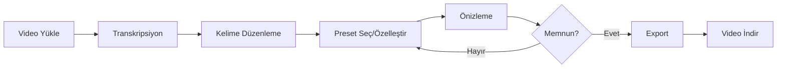

# 🎬 Subcio - AI-Powered Subtitle Generator

> **Bu dosya, AI asistanlarının (Claude, Gemini, GPT vb.) bu projeyi anlaması, hatırlaması ve yönetmesi için hazırlanmıştır.**

---

## 📋 Proje Özeti

**Subcio**, yapay zeka destekli profesyonel bir altyazı oluşturma ve stilizasyon platformudur. Kullanıcılar video/ses dosyalarını yükleyerek otomatik transkripsiyon alabilir, 50'den fazla karaoke efektiyle altyazıları özelleştirebilir ve videoya gömülü olarak dışa aktarabilir.

### Temel Özellikler
- **AI Transkripsiyon**: Whisper (faster-whisper) ile kelime seviyesinde zaman damgalı transkripsiyon
- **Gelişmiş Stilizasyon**: 50+ PyonFX tabanlı karaoke efekti
- **Gerçek Zamanlı Önizleme**: ASS subtitle formatında canlı önizleme
- **Video Export**: FFmpeg ile altyazıların videoya yakılması
- **Batch Export**: Toplu video işleme desteği
- **Preset Sistemi**: Kaydetme, düzenleme, kategorilere ayırma
- **Masaüstü Uygulaması**: Electron ile Windows/macOS desteği

---

## 🏗️ Proje Mimarisi

```
subcio-app/
├── backend/                    # FastAPI Backend (Python)
│   ├── main.py                # Ana API (2800+ satır, tüm endpoint'ler)
│   ├── styles/                # Efekt sistemi
│   │   └── effects/           # PyonFX efekt implementasyonları
│   │       ├── pyonfx_effects.py       # Efekt sınıfları
│   │       ├── pyonfx_render_impls.py  # Render implementasyonları
│   │       └── pyonfx_render_mixin.py  # Ortak render mantığı
│   ├── services/              # Harici servisler
│   │   └── groq_transcription.py  # Groq AI transkripsiyon
│   ├── fonts/                 # Gömülü fontlar (70+)
│   ├── presets.json          # Tüm preset konfigürasyonları
│   └── pyonfx_effects.json   # Efekt metadata
│
├── frontend/                  # React Frontend (TypeScript)
│   └── src/
│       ├── pages/            # Sayfa bileşenleri
│       │   ├── DashboardPage.tsx    # Proje listesi
│       │   ├── UploadPage.tsx       # Video yükleme
│       │   ├── EditorPage.tsx       # Ana düzenleyici
│       │   ├── ExportPage.tsx       # Dışa aktarma
│       │   ├── SettingsPage.tsx     # Ayarlar
│       │   ├── OnboardingPage.tsx   # Model indirme
│       │   └── AdminPage.tsx        # Yönetici paneli
│       ├── components/       # Yeniden kullanılabilir bileşenler
│       │   ├── PresetEditor.jsx     # Preset düzenleyici (66KB)
│       │   ├── SubtitleOverlay.jsx  # Altyazı overlay
│       │   ├── ControlPanel.jsx     # Kontrol paneli
│       │   └── editor/              # Editor alt bileşenleri
│       │       ├── PresetGallery.tsx
│       │       ├── Timeline.tsx
│       │       ├── VideoPlayer.tsx
│       │       └── TranscriptPanel.tsx
│       ├── contexts/         # React Context'ler
│       │   ├── ToastContext.tsx
│       │   ├── LicenseContext.tsx
│       │   └── SettingsContext.tsx
│       ├── hooks/            # Custom Hook'lar
│       │   ├── useMediaPlayer.ts
│       │   ├── useAssPreview.ts
│       │   └── useKeyboardShortcuts.ts
│       ├── services/         # API servisleri
│       │   ├── ffmpegService.ts
│       │   └── logService.ts
│       └── utils/            # Yardımcı fonksiyonlar
│           ├── colorConvert.ts
│           ├── fontService.ts
│           └── timeFormat.ts
│
├── electron/                 # Electron Masaüstü (Node.js)
│   ├── main.js              # Ana süreç (backend yönetimi)
│   ├── preload.js           # Güvenlik köprüsü
│   ├── license-manager.js   # Lisans yönetimi
│   └── build.js             # Yapı scripti
│
└── docs/                     # Dokümantasyon
```

---

## 🔧 Teknoloji Yığını

### Backend (Python 3.10+)
| Teknoloji | Sürüm | Kullanım |
|-----------|-------|----------|
| FastAPI | 0.110.0 | API Framework |
| Uvicorn | 0.29.0 | ASGI Server |
| faster-whisper | 1.0.3 | AI Transkripsiyon |
| Pillow | - | Görüntü işleme, Font ölçümü |
| FFmpeg | - | Video işleme |
| Groq | 0.9.0 | Alternatif AI API |

### Frontend (Node.js 18+)
| Teknoloji | Sürüm | Kullanım |
|-----------|-------|----------|
| React | 18.x | UI Framework |
| TypeScript | 5.x | Tip güvenliği |
| MUI | 6.x | UI Bileşenleri |
| Vite | 5.x | Build tool |
| Framer Motion | 10.x | Animasyonlar |
| jassub | 1.8.6 | ASS subtitle render |
| i18next | 25.x | Çoklu dil desteği |

### Electron
| Teknoloji | Sürüm | Kullanım |
|-----------|-------|----------|
| Electron | 28.x | Masaüstü wrapper |
| electron-builder | 24.x | Paketleme |
| electron-updater | 6.x | Otomatik güncelleme |

---

## 📡 API Endpoint'leri

### Transkripsiyon
| Endpoint | Method | Açıklama |
|----------|--------|----------|
| `/api/transcribe` | POST | Video/ses dosyasını transkribe et |
| `/api/model/status` | GET | Whisper model durumunu kontrol et |
| `/api/model/download` | GET (SSE) | Model indirme (streaming) |

### Projeler
| Endpoint | Method | Açıklama |
|----------|--------|----------|
| `/api/projects` | GET | Tüm projeleri listele |
| `/api/projects/{id}` | GET | Proje detayı |
| `/api/projects` | POST | Yeni proje oluştur |

### Preset'ler
| Endpoint | Method | Açıklama |
|----------|--------|----------|
| `/api/presets` | GET | Tüm preset'leri getir |
| `/api/presets` | POST | Yeni preset oluştur |
| `/api/presets/{id}` | PUT | Preset güncelle |
| `/api/presets/{id}` | DELETE | Preset sil |
| `/api/presets/categories` | GET/POST | Kategori yönetimi |

### Export
| Endpoint | Method | Açıklama |
|----------|--------|----------|
| `/api/export` | POST | Video export (subtitle yakma) |
| `/api/preview-ass` | POST | ASS önizleme |
| `/api/batch-export` | POST | Toplu export başlat |
| `/api/batch-export/{id}` | GET | Batch durumu |
| `/api/export/options` | GET | Codec/çözünürlük seçenekleri |

### Efektler
| Endpoint | Method | Açıklama |
|----------|--------|----------|
| `/api/effect-types` | GET | Tüm efekt türleri |
| `/api/pyonfx/effects` | GET | PyonFX efekt listesi |
| `/api/pyonfx/preview` | POST | Efekt önizleme |

### Fontlar
| Endpoint | Method | Açıklama |
|----------|--------|----------|
| `/api/fonts` | GET | Kullanılabilir fontlar |

### Model Yönetimi
| Endpoint | Method | Açıklama |
|----------|--------|----------|
| `/api/models` | GET | İndirilen modelleri listele |
| `/api/models/{name}` | DELETE | Model sil |

---

## 🎨 Efekt Sistemi

### Efekt Kategorileri
Subcio 50'den fazla önceden tanımlı efekt içerir:

1. **Parçacık Efektleri**: fire_storm, bubble_floral, falling_heart, ghost_star
2. **Glitch Efektleri**: cyber_glitch, chromatic_aberration, matrix_rain
3. **Hareket Efektleri**: kinetic_bounce, earthquake_shake, wave, shake
4. **Işık Efektleri**: neon_pulse, thunder_strike, electric_shock
5. **Renk Efektleri**: rainbow_wave, colorful
6. **Tipografi**: typewriter_pro, news_ticker, comic_book
7. **Lüks/Premium**: luxury_gold, cinematic_blur
8. **Özel**: tiktok_group, word_pop, pulse

### Efekt Yapısı (presets.json)
```json
{
  "preset-id": {
    "id": "preset-id",
    "primary_color": "&H00FFFFFF",    // ASS renk formatı
    "outline_color": "&H00000000",
    "shadow_color": "&H00000000",
    "font": "Inter",
    "font_size": 150,
    "alignment": 5,                    // 1-9 numpad konumu
    "margin_v": 40,
    "bold": 1,
    "border": 2,
    "shadow": 3,
    "effect_type": "fire_storm",      // PyonFX efekt tipi
    "effect_config": {                 // Efekte özel parametreler
      "particle_count": 12,
      "min_speed": 30,
      "max_speed": 120
    }
  }
}
```

### PyonFX Render Sistemi

Efektler `backend/styles/effects/` altında uygulanır:

1. **pyonfx_effects.py**: Efekt sınıfları (BulgeEffect, ShakeEffect, WaveEffect, vb.)
2. **pyonfx_render_impls.py**: Her efekt için ASS render implementasyonu (240KB+)
3. **pyonfx_render_mixin.py**: Ortak render yardımcıları

---

## 📁 Önemli Dosyalar

### Backend
| Dosya | Satır | Açıklama |
|-------|-------|----------|
| `main.py` | 2867 | Tüm API endpoint'leri, iş mantığı |
| `presets.json` | 3707 | 50+ preset konfigürasyonu |
| `pyonfx_render_impls.py` | 242KB | Efekt render implementasyonları |

### Frontend
| Dosya | Boyut | Açıklama |
|-------|-------|----------|
| `PresetEditor.jsx` | 66KB | Preset düzenleyici UI |
| `EditorPage.tsx` | 32KB | Ana editor sayfası |
| `PresetGallery.tsx` | 25KB | Preset galerisi |
| `theme.ts` | 22KB | MUI tema konfigürasyonu |
| `SubtitleOverlay.jsx` | 17KB | Altyazı overlay bileşeni |

---

## 🔄 Tipik İş Akışı



### Detaylı Akış

1. **Upload (UploadPage)**: Kullanıcı video/ses dosyası yükler
2. **Transkripsiyon**: Whisper API kelime seviyesinde timestamp'ler üretir
3. **Editor (EditorPage)**: 
   - Sol panel: Transkript düzenleme
   - Orta: Video oynatıcı + ASS overlay
   - Sağ: Preset galerisi + stil ayarları
4. **Preset Seçimi**: 50+ hazır efektten biri seçilir veya özelleştirilir
5. **Export**: FFmpeg ile ASS subtitle videoya yakılır

---

## ⚙️ Konfigürasyon

### Backend Ortam Değişkenleri
```env
# .env örneği
PORT=8000
MAX_UPLOAD_SIZE=524288000  # 500MB
ALLOWED_ORIGINS=http://localhost:5173
HF_HOME=~/.cache/huggingface  # Whisper model dizini
```

### Frontend Ortam Değişkenleri
```env
# .env örneği
VITE_API_URL=http://localhost:8000/api
```

---

## 🚀 Çalıştırma Komutları

### Geliştirme
```bash
# Backend
cd backend
python -m venv venv
venv\Scripts\activate  # Windows
pip install -r requirements.txt
uvicorn main:app --reload --port 8000

# Frontend (ayrı terminal)
cd frontend
npm install
npm run dev  # http://localhost:5173
```

### Electron Desktop
```bash
cd electron
npm install
npm run dev  # Hem frontend hem backend başlatır
```

### Production Build
```bash
# Windows
cd electron
npm run build        # NSIS installer + Portable

# macOS
npm run build:mac    # DMG
```

---

## 🧪 Test Etme

### Backend API Testi
```bash
# Health check
curl http://localhost:8000/api/health

# Model durumu
curl http://localhost:8000/api/model/status

# Presetler
curl http://localhost:8000/api/presets
```

### PyonFX Efekt Testi
```bash
cd backend
python test_pyonfx_effects.py
# test_*_output.ass dosyaları oluşturulur
```

---

## 🐛 Bilinen Sorunlar ve Çözümler

### 1. Model İndirme Hatası
**Sorun**: Whisper modeli indirilemiyor
**Çözüm**: HF_HOME dizininin yazılabilir olduğundan emin olun

### 2. Font Bulunamıyor
**Sorun**: Preset'te belirtilen font yok
**Çözüm**: `backend/fonts/` dizinine font ekleyin veya sistem fontlarını kullanın

### 3. Export Yavaş
**Sorun**: Video export çok uzun sürüyor
**Çözüm**: resolution="720p" veya bitrate="low" kullanın

### 4. ASS Önizleme Çalışmıyor
**Sorun**: jassub worker yüklenemiyor
**Çözüm**: `public/jassub/` dizininde worker dosyalarını kontrol edin

---

## 📝 Geliştirme Notları

### Yeni Efekt Ekleme
1. `pyonfx_effects.py` içinde yeni sınıf oluştur
2. `pyonfx_render_impls.py` içinde render fonksiyonu ekle
3. `RENDER_DISPATCH` sözlüğüne kaydet
4. `presets.json` içine örnek preset ekle

### Yeni Sayfa Ekleme
1. `frontend/src/pages/` altında yeni `.tsx` dosyası oluştur
2. `App.tsx` içine Route ekle
3. Gerekirse navigasyon menüsüne link ekle

### API Endpoint Ekleme
1. `main.py` içine yeni endpoint tanımla
2. Pydantic model kullan (tip güvenliği)
3. Logging ekle (`api_logger`)

---

## 🔗 Faydalı Linkler

- **PyonFX**: https://github.com/CoffeeStraw/PyonFX
- **Faster Whisper**: https://github.com/guillaumekln/faster-whisper
- **ASS Format Spec**: https://github.com/libass/libass/blob/master/doc/ass-specs.md
- **MUI**: https://mui.com/
- **Electron**: https://www.electronjs.org/

---

## 📊 Proje İstatistikleri

| Metrik | Değer |
|--------|-------|
| Backend Satır | ~2900 |
| Frontend Bileşen | 30+ |
| Efekt Sayısı | 50+ |
| Font Sayısı | 70+ |
| Preset Sayısı | 50+ |
| API Endpoint | 35+ |

---

## 🎯 Gelecek Geliştirmeler (Roadmap)

- [ ] Çoklu dil transkripsiyon
- [ ] Konuşmacı tanıma (speaker diarization)
- [ ] Cloud sync
- [ ] Mobil uygulama
- [ ] AI stilizasyon önerileri
- [ ] Gerçek zamanlı işbirliği

---

> **Son Güncelleme**: 2025-12-11
> 
> Bu dosya AI asistanları için hazırlanmıştır. Proje hakkında sorularınız için bu dosyayı referans alın.
